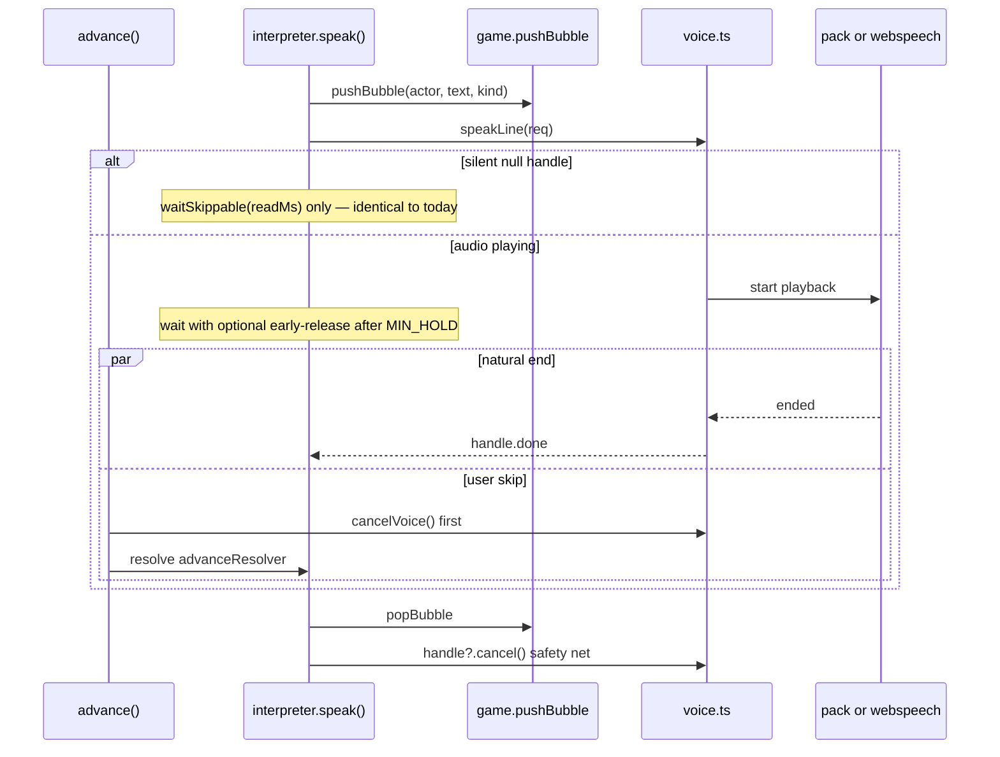
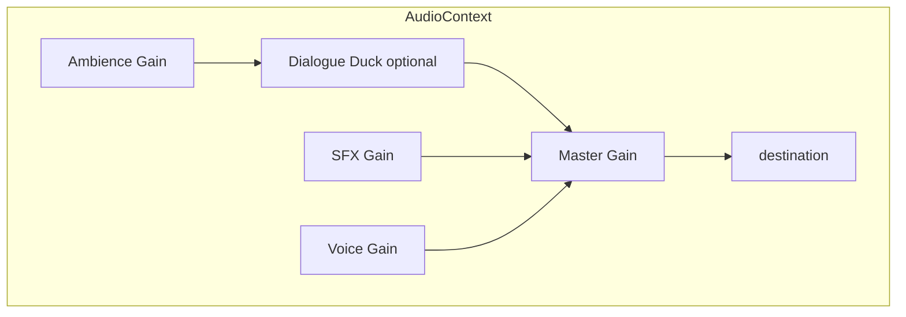

# New Amsterdamned — Improvements, Features & Voice Roadmap

| Field | Value |
|---|---|
| **Document** | Forward roadmap (does **not** replace `DESIGN.md`) |
| **Author** | — |
| **Date** | 2026-07-26 |
| **Status** | Draft (rev 2.1 — silent wait contract) |
| **Live** | https://newamsterdamned.vercel.app/ |
| **Repo** | `/Users/lindau/.grok/worktrees/codex-newamsterdamned/newamsterdamned` |
| **Audience** | Senior engineers implementing post-ship polish |

---

## Overview

*New Amsterdamned* is a complete, playable four-act SCUMM-style point-and-click adventure (~20k LOC content + engine, static Vercel deploy). The engine (`src/lib/engine/`) is content-agnostic; content lives as data in `src/lib/game/`. Speech already has three visual registers (`say` / `think` / `narrate`) via `speak()` in `interpreter.ts` and `Bubbles.svelte`. Audio is procedural Web Audio SFX only; scene `ambience` is authored on all fifteen rooms but never plays.

This document is a **forward roadmap** in three pillars:

1. **Improvements** — quality, polish, accessibility, performance, content/art gaps grounded in actual code.
2. **New features** — ruthlessly prioritised expansions that fit a *finished* game, not an MVP.
3. **Voice** (primary focus) — full technical design for narrator, protagonists, and NPC spoken audio, with cost/latency/licensing analysis and a phased plan that never breaks silent play.

Tone and comedy rules remain those of `DESIGN.md` §2 (jokes point up; enslaved/half-free Africans and the Peach Tree War handled straight). This roadmap **additionally** treats Jewish refugee characters (Levy, Barsimson; Recife 1654) as a protected register for voice casting — historically central in `DESIGN.md` §3, even though §2 does not list them as a third explicit "straight" subject. Solvability tests (`act*.solvable.test.ts`) and content integrity (`content.test.ts`) must keep working.

---

## Background & Motivation

### Current state (verified in code)

| Layer | Path | Notes |
|---|---|---|
| Engine | `src/lib/engine/` | `types.ts`, `state.svelte.ts`, `interpreter.ts`, `geometry.ts`, `save.ts`, `audio.ts`, `registry.ts`, `interaction.ts` |
| Content | `src/lib/game/` | Act 1–4 scenes/dialogue/items, almanac (63), protagonists, objectives, art |
| UI | `src/lib/components/` | Stage, VerbCoin, Bubbles, Choices, Inventory, Almanac, Hints, Title, ActEnd, Game |
| Deploy | `vite.config.ts` + `adapter-static` | Fully prerendered; no server functions |

**Stack:** SvelteKit 2 + Svelte 5 runes, TypeScript strict, DOM/CSS over inline SVG backgrounds (no canvas), ~420KB text-only static footprint (no binary media).

**Content scale (measured from content trees; keep honest via extract script / `content.test.ts` one-liner):**

| Metric | Value |
|---|---|
| Scenes | 15 (4 + 4 + 4 + 3: `SCENES`, `SCENES_ACT2`, `SCENES_ACT3`, `SCENES_ACT4`) |
| Named speaking NPCs (LINE/SAY actors) | 15: `barsimson`, `domingo`, `griet`, `klapperman`, `kleyn`, `levy`, `mattaneck`, `notary`, `pawnbroker`, `sergeant`, `skipper`, `stuyvesant`, `tienhoven`, `vandyck`, `yankee` (Mudge) |
| Speech actions | **1,768** (`SAY` 399 · `THINK` 600 · `LINE` 533 · `NARRATE` 236) |
| Speech corpus | ~**160k characters** (~32k words) of authored `text:` on speech ops |
| Dual-protagonist TTS load | **>160k** — Joost and Trijn each render player-facing lines; extract must report unique keys (see §3.11) |
| Max score | 970 (`SCORE_MAX` = 225+275+325+145 in `src/lib/game/index.ts`) |
| Almanac entries | 63 |
| LOC | ~19.7k under `src/` |

**Speech choke point** — all spoken text already funnels through one function:

```62:67:src/lib/engine/interpreter.ts
async function speak(actor: string, raw: string, kind: 'say' | 'think' | 'narrate') {
	const text = resolveText(raw);
	const id = game.pushBubble(actor, text, kind);
	await waitSkippable(readingTime(text));
	game.popBubble(id);
}
```

**Audio gap** — `Scene.ambience` is a typed union (`harbour|tavern|fort|wall|market|workshop|chamber`) set on every scene, but `audio.ts` only implements one-shot `playSfx()` stings that connect **directly to `ac.destination`**. Mute is an in-memory flag (`setMuted` / `isMuted`); it is **not** persisted across sessions.

**Art gap vs DESIGN.md claim** — `types.ts` documents `background` as URL **or** inline SVG. `Stage.svelte` currently always does:

```svelte
<div class="bg">{@html scene.background}</div>
```

So a bare `/art/foo.webp` path would inject text, not an image. Painted art needs a small Stage branch (see §1.6) — not a renderer rewrite, but also not "zero engine change."

**UX gaps observed:**

- Mute does not survive reload; no volume, text-size, or voice settings.
- Verb coin comment claims long-press support (`VerbCoin.svelte`); Stage only wires `onclick` / `oncontextmenu` — mobile long-press is incomplete or absent.
- Space-to-reveal requires a physical keyboard; no on-screen affordance for touch.
- Settings live only as a mute emoji and a save menu inside `Game.svelte`.

### Pain points this roadmap addresses

1. **Atmosphere is half-finished** — ambience data exists; no loops, no music bed.
2. **Polish ceiling** — procedural SVG art and SFX are intentional placeholders (`DESIGN.md` §6–7); URL drop-in is documented but Stage does not yet render raster backgrounds.
3. **Accessibility / mobile** — DOM architecture is a11y-friendly; touch and settings are not finished products.
4. **Voice demand** — text density is high (~1.8k lines); silent play works, but spoken delivery would land jokes, dialect, and Act IV gravity harder — *if* it stays progressive, cheap enough, and tone-safe.

---

## Goals & Non-Goals

### Goals

- Keep **static deploy**, **no required server**, and **silent play as the default**.
- Wire existing data hooks (ambience, speech registers, mute) before inventing new systems.
- Deliver **MVP voice** that maps actors → voices without re-authoring content.
- Preserve solvability and content tests; keep engine content-agnostic via the **`registry.ts` registration pattern** (engine never imports `src/lib/game/*`).
- Respect `DESIGN.md` §2 (jokes point up; enslaved/half-free Africans and Peach Tree War handled straight).
- For voice packs, treat **Jewish refugee characters** (Levy, Barsimson) as a protected register with anti-caricature rules (roadmap extension; see §3.8.1).
- Prefer MIT-compatible assets and licences that allow **CDN redistribution** of generated audio.

### Non-Goals

- Rewriting `DESIGN.md` or rebalancing the four acts.
- Canvas/WebGL rewrite; pathfinding graphs; multiplayer gameplay.
- Server-authoritative cloud saves as a hard requirement (optional later).
- Full re-recording with human actors in v1 of this roadmap (may be a future luxury pack).
- Mic input, voice commands, or any uplink of player audio.
- Shipping multi-megabyte voice packs in the default first-load bundle.
- **Spoken dialogue choice prompts** (`askChoices` / `Choices.svelte`) — menus stay text-only; do not bolt TTS onto prompts.
- Speculative preload across `IF` / `DIALOGUE` / `GOTO` (see §3.15).

---

## Pillar 1 — Improvements to the Existing Game

Prioritise work that closes **code-visible gaps** with high player impact and low architectural risk.

### 1.1 Ambience wiring (high impact, low effort)

**Gap:** Every scene sets `ambience` (e.g. `pearl-street` → `harbour`, `wooden-horse` → `tavern`); nothing consumes it. Current `tone()` / `noise()` in `audio.ts` connect straight to `destination`.

**Design (PR 2 scope):**

1. Refactor `audio.ts` to a shared `AudioContext` with bus gains:
   - `master` → `destination`
   - `sfx` → `master`
   - `ambience` → `master`
   - (Voice bus attaches in PR 10 — not required for ambience shipping.)
2. Rewire existing SFX to `sfx` gain; introduce `setAmbience(name | null)`.
3. Procedural low-gain looping bed per ambience key; **stop and dispose** previous bed nodes on scene change and on mute (no unbounded oscillator leak).
4. Crossfade 400–800ms between beds.
5. Hook from scene change (`enterScene` or `$effect` on `game.scene`).
6. Honour `muted`, `masterVolume`, `ambienceVolume` from settings.

**Do not** implement voice ducking in PR 2 — only ensure the graph has a place for a future voice bus. Optional mild duck of ambience under SFX stings is fine if cheap.

**Procedural bed sketches:**

| Key | Texture |
|---|---|
| `harbour` | Low noise + occasional gull-like sweeps (reuse `gull` motif, quieter) |
| `tavern` | Soft mid hum + sparse wood/clink noise |
| `fort` | Distant wind + low drone |
| `wall` | Wind through palisade (bandpassed noise) |
| `market` | Busier mid-frequency murmur (noise clusters) |
| `workshop` | Occasional dull thuds / scrape ticks |
| `chamber` | Near-silence + very low room tone |

**Act IV default policy (unblocks PR 10 without waiting on PO):** ambience **continues** (harbour/wall as authored); **no music**; voice rate slightly slower for `NARRATE`. PO may later choose deeper silence (Open Question remains for override).

**Files:** `audio.ts`, `interpreter.ts` or `Game.svelte`, `settings.ts`.

### 1.2 Settings persistence & audio controls

**Gap:** `muted` is module-local in `audio.ts`; `Game.svelte` re-reads on mount but never writes to `localStorage`.

**Design:** New thin module `src/lib/engine/settings.ts` with key `newamsterdamned:settings` (separate from save slots). Single source-of-truth type:

```ts
export type VoiceBackendPref = 'auto' | 'pack' | 'webspeech' | 'off';

export type Settings = {
  muted: boolean;
  masterVolume: number;      // 0–1
  sfxVolume: number;         // 0–1
  ambienceVolume: number;    // 0–1
  voiceEnabled: boolean;     // master voice gate (default false)
  voiceVolume: number;       // 0–1
  thinkVoice: 'off' | 'soft' | 'full';
  voiceBackend: VoiceBackendPref; // default 'auto'
  /** Captions are always on in product; field reserved, forced true on load. */
  captionsAlways: true;
  textScale: number;         // 1.0 | 1.15 | 1.3
  textSpeed: number;         // multiplies bubble readingTime only (not TTS rate by default)
  reduceMotion: boolean | 'system'; // true | false | 'system'
  packVersionPinned?: string; // optional force pack version / disable bad pack
};

/** Defaults match today's behaviour: unmuted, full procedural levels, voice off. */
export const DEFAULT_SETTINGS: Settings = {
  muted: false,
  masterVolume: 1,
  sfxVolume: 1,
  ambienceVolume: 1,
  voiceEnabled: false,
  voiceVolume: 0.8,
  thinkVoice: 'soft',
  voiceBackend: 'auto',
  captionsAlways: true,
  textScale: 1,
  textSpeed: 1,
  reduceMotion: 'system'
  // packVersionPinned: undefined
};

export function loadSettings(): Settings;   // validate + clamp volumes 0–1; force captionsAlways true
export function saveSettings(patch: Partial<Settings>): void;
export function getSettings(): Settings;
```

Apply on boot before first SFX; expose in menu panel in `Game.svelte`. Mute button = master mute (SFX + ambience + voice).

### 1.3 Mobile / touch polish

**Gaps verified:** Stage wires click / contextmenu / keyboard `V` only; Space reveal is keyboard-only via `revealing` in `Game.svelte`.

**Pointer state machine (PR 3 acceptance):**

| Event | Behaviour |
|---|---|
| `pointerdown` on hotspot/inventory | Start 500ms timer; record `x,y` |
| `pointermove` beyond 10px | Cancel long-press (allow scroll/drag intent) |
| Timer fires | Open `VerbCoin` at point; set `longPressOpened = true`; `preventDefault` |
| `pointerup` / `click` after long-press | **Suppress** defaultVerb / walk — do not also fire left-click action |
| `pointerup` before timer | Normal click path (walk / defaultVerb) |
| Inventory long-press | Same coin path as desktop right-click on item |
| iOS | `-webkit-touch-callout: none`, `user-select: none` on stage; handle `contextmenu` |

Also: **Hold-to-reveal button** in HUD mirroring `revealing`; min 44px touch targets; verb coin clamp on narrow viewports (already partial).

Manual test checklist lives in PR 3 description (scroll conflict, rapid tap, coin open then outside dismiss).

### 1.4 Accessibility

**Already good:** DOM hotspots with `role="button"`, `aria-label`, keyboard Enter/Space/V; bubbles `aria-live="polite"`; `prefers-reduced-motion` in several components; focus styles in `app.css`; numbered dialogue choices.

**Improvements:**

| Item | Approach |
|---|---|
| Screen reader focus during cutscenes | When `game.busy` and bubble active, ensure live region updates; optional `aria-atomic` |
| Skip announcement spam | Debounce rapid bubble churn on advance-spam |
| Text size | CSS variable `--text-scale` from settings on bubbles + choices |
| Colour-only speaker cues | Keep name labels (already present on `say`); ensure contrast on accent colours |
| Reduced motion | Gate walk bob / bubble rise if settings force reduce motion |
| Focus trap | Almanac / Hints / Menu dialogs should trap Tab (partial today) |

**`textSpeed` vs voice (K17):** `textSpeed` multiplies **bubble hold / readingTime only**. Voice playback rate is controlled by profile `speechRate` / pack audio length, not by textSpeed — so slow readers can linger on captions without chipmunk/slow-mo audio. (Optional future: separate "voice rate" control.)

### 1.5 Content & script polish

- Pass for orphaned flags / dead dialogue branches (extend `content.test.ts` where mechanical).
- Timing: `readingTime()` uses `900 + len*42` capped at 7s — long NARRATE lines feel rushed; use kind-specific floors (`narrate` slower, `think` slightly faster).
- Fallback lines in `interaction.ts` are strong; **default: no voice on interaction fallbacks** (§3.6) — extract may list them as `skip`, not expand the `{name}`/`{item}` template set.
- Act IV zero-score rescues: do not "fix" scoring; tests enforce this — leave alone.

### 1.6 Art upgrade path (minimal Stage change)

`DESIGN.md` §5–7 and `types.ts` already allow URL **or** inline SVG. **Runtime Stage does not.**

**Required Stage change (PR 14):**

```svelte
{#if isInlineSvg(scene.background)}
  <div class="bg">{@html scene.background}</div>
{:else}
  <div class="bg bg--raster" style="background-image:url({scene.background})"></div>
  <!-- or  with object-fit cover -->
{/if}
```

Helper: `isInlineSvg(src) => src.trimStart().startsWith('<svg')`. Same rule for `SceneLayer.src` if raster layers appear later.

**Path after Stage fix:**

1. Commission or paint per-scene `.webp` under `static/art/`.
2. Point `background` at `/art/{sceneId}.webp`.
3. Keep procedural SVG as fallback / low-data mode via settings.
4. Optional progressive load: SVG first paint, swap webp when loaded.

**Estimate:** 15 backgrounds × ~80–200KB webp ≈ 1.2–3MB — optional pack; lazy load.

Sprites remain procedural (`art/actor.ts`) until a second pass; silhouette + palette already carry identity.

### 1.7 Performance

| Risk | Mitigation |
|---|---|
| Huge inline SVG strings in JS bundles | Move backgrounds to static files; code-split by act if needed |
| `@html` SVG reparse | Cache sprite strings; avoid regenerating every frame |
| Save JSON size | Already tiny |
| Future voice assets | Lazy per-act / per-pack; never block first paint; **binaries not in git** (see §3.16) |

### 1.8 Bugs / hardening checklist

- Scene-change aborts scripts via `SceneChanged` — cancel voice on same token **and** inside `advance()` / `enterScene` before `clearBubbles`.
- Private-mode `localStorage` already probed in `save.ts` — reuse for settings.
- Autosave on scene change — voice preload must not race restore.
- `SAVE_VERSION = 3` — bump only if save schema changes; settings stay out of save blobs.

---

## Pillar 2 — New Features (ruthless prioritisation)

This is a **finished** four-act game. Features must earn their keep.

### Prioritisation matrix (impact × effort)

| Feature | Impact | Effort | Priority | PR |
|---|---|---|---|---|
| Ambience loops | High | Low | **P0** | PR 2 |
| Settings + persistence | High | Low | **P0** | PR 1 |
| Mobile long-press + reveal | High | Med | **P0** | PR 3 |
| Voice MVP (Web Speech) | High | Med | **P0** | PR 5–6 |
| Text speed / type scale | Med | Low | **P1** | PR 4 |
| Voice packs (hybrid → full) | High | High | **P1** | PR 7–10, 13 |
| Simple map (visited scenes) | Med | Med | **P1** | PR 11 |
| Save export/import | Med | Low | **P1** | PR 12 |
| Painted art pilot + Stage URL | High | Med eng + art | **P2** | PR 14 |
| Achievements beyond score | Med | Med | **P2** | — |
| Music stings | Med | Med | **P2** | — |
| Translations (i18n) | High | High | **P3** | — |
| Cloud saves | Low–Med | Med–High | **P3** | — (export first) |
| Shareable moments | Low | Med | **P3** | — |
| Analytics-light | Low | Low | **P3** | — |
| Multiplayer | — | — | **Out** | — |

### Recommended feature designs (P1+)

#### Journal (lightweight)

Do **not** duplicate Almanac. Prefer improving Hints copy (`objectives.ts` + `Hints.svelte`) over a second meta-system.

#### Map (PR 11)

- Data: `{ sceneId, label, act, exits[] }` derived from exit hotspots (`exit: true`).
- **Scene→act mapping** lives in content (e.g. `src/lib/game/acts.ts`: `SCENE_ACT: Record<string, 1|2|3|4>` built from the four scene arrays). Scenes have **no** `act` field today.
- Unlock fog-of-war from `game.visited`.
- Non-teleporting; SVG schematic.

#### Achievements

Local badges only; do not grade Act IV morality (zero score remains law).

#### Music

If added: procedural/short loops; **no music under Act IV raid** by default. Prefer silence over wrong music.

#### Save export/import (PR 12)

Download/upload slot JSON — static-compatible cloud substitute.

#### i18n (deferred)

Dialect + dual protagonists make this its own product.

---

## Pillar 3 — Voice (Primary Focus)

### 3.1 Design goals

| Goal | Spec |
|---|---|
| Additive | Bubbles remain primary; voice never replaces text |
| Progressive | Default = silent. Voice opt-in |
| Content-agnostic | Engine uses `getVoiceProfile` from registry; never imports `game/` |
| Skip-safe | `advance()` cancels in-flight utterance **before** resolving wait |
| Private | No microphone; no default cloud TTS |
| Static-preferring | Packs on CDN; no client API keys |
| Tone-safe | Casting matches §3.8 + historical-person rules |

### 3.2 Integration architecture



#### VoiceHandle contract

```ts
export type VoiceHandle = {
  /** Monotonic generation; stale onend/onerror must ignore if gen !== currentGen */
  gen: number;
  /** Resolves when playback ends naturally or after cancel settles */
  done: Promise<void>;
  /** Best-effort duration from pack manifest (ms); optional for Web Speech */
  estimatedMs?: number;
  /** True only if audio actually started (or pack duration is known and committed). */
  didPlay: true;
  cancel(): void;
};

/**
 * speakLine returns:
 * - null  → no audio will play (silent path). Caller MUST NOT early-release.
 * - handle with didPlay: true → audio started (or pack hit with known duration).
 *
 * NEVER return a "no-op handle" with done already resolved — that breaks bubble timing.
 */
export function speakLine(req: VoiceRequest): VoiceHandle | null;
```

#### Timing rule (product default) — silent path is sacred

**Invariant (regression-critical):** Early-release on `handle.done` is allowed **only** when `handle !== null` and `handle.didPlay === true` (audio actually started, or a pack hit supplied `estimatedMs` and playback was committed). Silent outcomes **must** return `null` and use **only** `waitSkippable(readMs)` — same as today's engine. Voice off must preserve pre-voice `readingTime` bubble hold.

| Outcome | `speakLine` returns | Bubble wait |
|---|---|---|
| `voiceEnabled` false / muted / `voiceBackend: 'off'` | `null` | `waitSkippable(readMs)` **only** |
| Hybrid silent (no pack key, WS disallowed, THINK off) | `null` | same |
| Headless / no `window` / vitest | `null` | same |
| Pack play | handle + `didPlay: true` + `estimatedMs` | hold formula + optional early release |
| Web Speech play | handle + `didPlay: true` (`estimatedMs` optional) | same; if synth fails before start → return `null` or cancel and fall through to remaining `readMs` **without** shortening below elapsed clock |
| Web Speech fails mid-utterance | handle already issued | cancel; do **not** drop below `max(elapsed, MIN_HOLD_MS)` of the original `readMs` floor — prefer finishing `waitSkippable` remainder |

Let:

- `readMs = readingTime(text, kind) * settings.textSpeed` (kind-aware floors inside `readingTime`; when voice off and `textSpeed === 1`, equals today's formula)
- `MIN_HOLD_MS = 600` — floor for **voiced** early-release only; **not** a replacement for `readMs` when silent
- `maxReadCap = min(max(readMs, estimatedMs ?? readMs) , 12_000)` — cap only when audio is involved and longer than read

```ts
async function speak(actor: string, raw: string, kind: 'say' | 'think' | 'narrate') {
  const text = resolveText(raw);
  const id = game.pushBubble(actor, text, kind);
  const speaker = resolveActorId(actor); // player → game.protagonist
  const readMs = readingTime(text, kind) * getSettings().textSpeed;
  const handle = speakLine({
    actor: speaker,
    text,
    kind,
    sceneToken: game.sceneToken
  });

  try {
    if (!handle) {
      // Silent path — identical to pre-voice behaviour (modulo textSpeed setting).
      await waitSkippable(readMs);
    } else {
      // Voiced path only.
      const estimated = handle.estimatedMs;
      const holdTarget = Math.min(
        Math.max(readMs, estimated ?? readMs),
        12_000
      );
      await waitSkippableWhileVoice(holdTarget, handle);
    }
  } finally {
    handle?.cancel(); // safety net; advance() already cancelled when skipping
    game.popBubble(id);
  }
}

/**
 * Voiced wait: user skip always wins; otherwise hold until holdTarget OR
 * (audio ended AND at least MIN_HOLD_MS elapsed since speak started).
 * Uses an elapsed clock — never `await wait(MIN_HOLD_MS)` after a possibly-resolved done.
 */
async function waitSkippableWhileVoice(holdTarget: number, handle: VoiceHandle): Promise<void> {
  const start = performance.now();
  await Promise.race([
    waitSkippable(holdTarget),
    (async () => {
      await handle.done;
      const elapsed = performance.now() - start;
      const remainingFloor = Math.max(0, MIN_HOLD_MS - elapsed);
      if (remainingFloor > 0) await wait(remainingFloor);
      // If audio was shorter than readMs, we release early after the floor.
      // If audio was longer, waitSkippable(holdTarget) usually wins unless user skips.
    })()
  ]);
}
```

**Why not race on silent null:** A handle with `done` already resolved would make the early-release arm win at ~`MIN_HOLD_MS` and collapse every line — violating K2 and “gameplay identical when voice off.”

#### Cancel-on-advance (critical)

Today `advance()` only resolves `advanceResolver` (`interpreter.ts`). **Change:**

```ts
export function advance() {
  cancelVoice(); // MUST run before resolver so next speakLine cannot overlap
  const r = advanceResolver;
  advanceResolver = null;
  r?.();
}
```

Also call `cancelVoice()` in `enterScene` before `clearBubbles`, and whenever `SceneChanged` is thrown / `sceneToken` changes.

**Generation token:** `voice.ts` increments `currentGen` on each **successful** (non-null) `speakLine` and on `cancelVoice`. Backend callbacks check `gen === currentGen` before resolving `done`. Web Speech: `speechSynthesis.cancel()` is async/quirky — after cancel, bump gen so a late `onend` cannot resolve a newer line.

**Pack cancel:** `HTMLAudioElement.pause(); audio.currentTime = 0` or stop `AudioBufferSourceNode`; resolve `done` synchronously after stop.

**Rules:**

1. Never throw from voice failures — log rate-limited; if audio never started, behave as `null` / silent `readMs` wait.
2. `THINK` / `NARRATE` use same pipeline with different profiles / DSP.
3. Headless / no `window` → `speakLine` returns **`null`** (not a resolved no-op handle).
4. PR 5 acceptance: with `voiceEnabled: false`, bubble hold matches pre-change `readingTime` (±ε for `textSpeed`); vitest asserts silent path never enters `waitSkippableWhileVoice`.

### 3.3 Actor resolution

| Authored `actor` | Resolves to |
|---|---|
| `player` | `joost` or `trijn` from `game.protagonist` |
| `narrator` | `narrator` |
| NPC id | same id |
| Missing / unknown | `generic` profile if registered, else silent |

Voice keys off **resolved** protagonist id, not the string `"player"`.

### 3.4 Options evaluation

#### Option A — Browser Web Speech API

| | |
|---|---|
| **How** | `speechSynthesis.speak(SpeechSynthesisUtterance)` |
| **Cost** | Free |
| **Latency** | Low (local/OS) |
| **Quality** | Poor–uneven; OS-dependent |
| **Bundle** | +~2–4KB code |
| **Fit** | MVP / a11y on **desktop**; weak prestige cast |

**Mobile policy (K18):** Web Speech **off by default on touch / coarse pointers** (quality and Safari quirks). Packs still work. User may force-enable via `voiceBackend: 'webspeech'`.

#### Option B — Cloud TTS at runtime

Rejected as default (keys, cost, privacy, breaks static). Optional power-user key mode remains an open PO question only.

#### Option C — Pre-generated voice packs (production path)

| | |
|---|---|
| **How** | Offline extract → TTS/VO → encode → CDN |
| **Format (K16)** | **Primary: MP3 mono ~40 kbps** for Safari/universality; optional secondary Opus/WebM in pipeline later |
| **Latency** | Decode only; narrow preload only (§3.15) |
| **Bundle** | 0 on first paint; lazy fetch |

See §3.11 for dual-protagonist cost/storage rewrite.

#### Option D — Hybrid (recommended production shape)

**Per-request** resolution — not a single global backend enum:

```
if !settings.voiceEnabled or muted → silent
else if pack manifest loaded AND key exists for this (speaker, kind, text) → pack
else if webspeechAllowed(speaker, kind, device) → webspeech
else → silent
```

- `voiceBackend: 'pack'` — pack only (missing key → silent, never webspeech).
- `voiceBackend: 'webspeech'` — webspeech only.
- `voiceBackend: 'auto'` — per-line order above.
- `voiceBackend: 'off'` — silent even if voiceEnabled (belt and braces).

Missing file: **never block**. THINK soft filter applies only when audio actually plays.

#### Option E — On-device neural TTS

Revisit later; keep facade pluggable.

### 3.5 Recommendation

1. **V0–V1:** Plumbing + Web Speech (desktop), default off.
2. **V2:** Pack pipeline + Act I narrator + Joost + Trijn (MP3). If budget slips: **V2a narrator-only** milestone inside PR 8.
3. **V3:** Priority NPC packs + hybrid per-line fallback.
4. **V4:** THINK DSP, voice bus ducking, narrow preload, full cast.

### 3.6 Content schema, registry wiring, extract coverage

**MVP — no Action schema change.** Resolve from `(resolvedActorId, kind, text)`.

**Optional later fields** (backward compatible):

```ts
| { op: 'SAY'; text: string; actor?: string; voiceId?: string; audioKey?: string }
| { op: 'LINE'; actor: string; text: string; voiceId?: string; audioKey?: string }
| { op: 'NARRATE'; text: string; voiceId?: string; audioKey?: string }
| { op: 'THINK'; text: string; voiceId?: string; audioKey?: string }  // no actor field — always player
```

Do **not** add `actor` to `THINK`.

#### Registry pattern (mandatory — mirrors scenes/items)

```ts
// engine/types.ts or engine/voice.ts — type only
export interface VoiceProfile {
  id: string;
  displayName: string;
  packSpeaker?: string;
  speechLang?: string;
  speechRate?: number;
  speechPitch?: number;
  speechVoiceNameRe?: string;
  thinkMode?: 'soft' | 'filter' | 'silent';
  /** If false, auto mode will not fall back to Web Speech for this speaker */
  allowWebSpeechFallback?: boolean;
  castingNotes?: string;
}

// engine/registry.ts
const voiceProfiles = new Map<string, VoiceProfile>();
export function registerVoiceProfiles(list: VoiceProfile[]): void;
export function getVoiceProfile(id: string): VoiceProfile | undefined;

// game/voiceProfiles.ts — DATA only
export const VOICE_PROFILES: VoiceProfile[] = [ /* ... */ ];

// game/index.ts loadContent()
registerVoiceProfiles(VOICE_PROFILES);
registerSceneActs(SCENE_ACT); // optional helper for pack lazy-load / map
```

**Engine must not import `src/lib/game/voiceProfiles.ts`.** Content registers at boot like scenes.

#### Audio key

```ts
audioKey = sha256(`${speakerId}|${kind}|${canonicalText}`).slice(0, 16)
// path: /voice/{packVersion}/{speakerId}/{audioKey}.mp3
```

Canonical text = post-token resolution. Build extract:

1. Expand all lines for **both** `joost` and `trijn` when text contains `{{` **or** when speaker is `player` (even without tokens — two voices).
2. Dedup identical `(speakerId, kind, canonicalText)`.
3. Special-case `interaction.ts` fallback templates: expand `{name}` / `{item}` over a fixed small vocabulary **or** mark fallbacks as `voice: skip` (prefer generate the ~20 template strings with placeholder spoken as "something" only if product wants; default **skip voice on fallbacks** to save budget).

#### SSML

Offline generation only.

### 3.7 How each register should sound

| Kind | Visual (existing) | Voice treatment |
|---|---|---|
| `say` / `LINE` | Named bubble, speaker colour | Full voice, character profile |
| `think` | Italic, dim | Soft mutter default (−8 dB, LPF); setting Off/Soft/Full; only if audio plays |
| `narrate` | Small-caps gold | Distinct narrator; slower; not Joost |

### 3.8 Character voice casting guide

Aligned with `DESIGN.md` §2–3 and `PALETTES` in `art/actor.ts`.

| Voice id | Role | Dialect / tone | Delivery notes |
|---|---|---|---|
| `narrator` | Stage directions | Neutral literary English | Deeper, slower; dry about the Company; never sneers at the vulnerable |
| `joost` | Protagonist | Dutch-colonist English | Comic timing; fear under bluster |
| `trijn` | Protagonist | Same world, sharper | **Not** "female Joost"; iron under wit |
| `griet` | Tapster | Local, impatient | Faster |
| `klapperman` | Night watch | Tired municipal | Comic sleep → Act IV gravity |
| `domingo` | Half-free African landholder | Plain, precise | **No minstrelsy**; never comic relief |
| `sergeant` | Loockermans | Company man | Brisk official |
| `yankee` (Mudge) | New Haven smuggler | New England English | Flat Yankee vowels |
| `pawnbroker` | Wolfertsen | Broker courtesy | Soft, assessing |
| `kleyn` | Merchant | Expensive ease | Delighted by blackmail |
| `mattaneck` | Lenape trader | Plain, dry, means what he says | **No broken English**; no mystical filter |
| `levy` | Asser Levy (real) | Sober Amsterdam burgher English | Measured; no sermonising |
| `barsimson` | Jacob Barsimson (real) | Worn, careful | Quieter; **distinct from Levy** |
| `tienhoven` | Schout Fiscal | Pleasant menace | Warm tone, cold content |
| `notary` | van Schelluyne | Precise | Professional kindness |
| `stuyvesant` | Director-General | Autocratic thunder | Rare lines; **no ableist comedy about the leg** |
| `skipper` | Gelderland master | Salt, practical | Unromantic exit |
| `vandyck` | Wounded | Confused, ruined | Not cartoon villain |

**Class fallbacks if budget forces collapse** — **never** for the protected set:

- `authority` ← stuyvesant, sergeant, tienhoven (satire OK; jokes point up)
- `burgher` ← kleyn, pawnbroker, notary
- `generic` ← minor one-offs only

**Protected set (K10 — absolute):** `domingo`, `mattaneck`, `levy`, `barsimson` must each be **distinct pack speakers or silent**. **Never** share a voice with each other or with `generic`. If budget is tight, ship fewer lines, not collapsed identities. PR 9 acceptance: Barsimson is distinct or silent — no "soft share."

#### 3.8.1 Historical persons & protected registers

| Subject | Source | Voice rule |
|---|---|---|
| Enslaved / half-free Africans (Domingo et al.) | `DESIGN.md` §2 | Straight; competent; no punchline voices |
| Peach Tree War / Act IV gravity | `DESIGN.md` §2 | Comedy steps back; narrator slower; no jaunty beds |
| Jewish refugees (Levy, Barsimson; Recife 1654) | `DESIGN.md` §3 history; **roadmap extends** | **Anti-caricature:** no comic "Jewish accent," no Yiddish-stage stereotypes, no conflating Sephardic Recife refugees with later Ashkenazi tropes; Amsterdam burgher English as DESIGN language notes imply |
| Stuyvesant's leg | Puzzle prop | Not a vocal joke target; no exaggerated "cripple" performance |
| Company / officials | Jokes point up | Satire allowed in delivery |

### 3.9 Settings UX

| Control | Default | Notes |
|---|---|---|
| Voice enabled | Off | Progressive enhancement |
| Voice volume | 80% | Independent of SFX |
| THINK voice | Soft | Off / Soft / Full |
| Backend | Auto | Per-line hybrid (§3.4 D) |
| Captions | On (forced) | No off switch for story text |
| Pack status | — | Show MB from manifest; "voices unavailable" on total failure |
| Force system voice | — | Sets backend webspeech / clears bad pack pin |

### 3.10 Offline build pipeline


**extract.ts must print (gate for PR 8):**

- Unique key count after dedup
- Character counts: raw authored, dual-protagonist expanded, per-speaker
- Estimated seconds @ configured rate
- Estimated MB @ 40 kbps MP3
- Estimated $ at OpenAI / ElevenLabs unit prices (config)
- Act I subset rows only when `--act=1`

**Binary hosting (K14):** Do **not** commit multi-MB packs to git. Store on object storage or CI artifacts; deploy step syncs to `voice/vN/` on the CDN (Vercel blob, R2, S3, or release asset). Repo keeps `scripts/voice/*` + tiny fixture for tests.

### 3.11 Cost & storage (revised)

| Layer | Measure | Notes |
|---|---|---|
| Authored speech chars | ~160k | One pass over content |
| Player-facing SAY+THINK | ~87k | Split across two speakers |
| Dual-protagonist expansion | **~200k+ chars of TTS input** | Every player line rendered as Joost **and** Trijn when building full packs; lines with `{{tokens}}` also need two resolved strings for NPCs addressing the player by name where applicable |
| Dedup | extract reports | Identical keys once |
| Unique duration | **unknown until extract** | Do not budget PR 8 on 45–90 min guess; require script output |
| Full cast @ MP3 40 kbps mono | extract → MB | Order-of-magnitude still ~10–25 MB if ~45–90 min; treat as TBD |
| Act I narrator + both protags | extract `--act=1` | PR 8 acceptance: **≤ 6 MB** compressed unless PO raises budget |
| OpenAI `tts-1` ~$15/1M chars | ~$3–5 raw on ~200–250k | Retries, HD, SSML inflate; plan **$10** contingency |
| ElevenLabs ~$0.05–$0.10/1k | ~$10–25 raw on 200k | **Plus** subscription floors; **redistribution/commercial game licence must be verified before generate** |
| CDN bandwidth | Vercel/CDN egress | Lazy per-line or per-act zip; manifest `bytes` for UI |
| Licence column | Y/N redistribution | Block PR 8 merge until provider ToS allows public game CDN hosting |

| Approach | One-time gen | Per play | Storage | Redistribute on CDN |
|---|---|---|---|---|
| Web Speech | $0 | $0 | 0 | n/a |
| OpenAI pack full | ~$3–10 | $0 | extract MB | check ToS |
| ElevenLabs pack full | ~$10–40+ | $0 | extract MB | **check plan** |
| Cloud runtime | low | ongoing $ | 0 | n/a |
| Human VO | $$$$$ | $0 | larger | own IP |

### 3.12 Privacy & security

- No microphone.
- Web Speech on-device/OS.
- Packs = download only.
- No default cloud keys in repo.
- MIT: licence gate before shipping audio.

### 3.13 Bundle size impact

| Piece | First load |
|---|---|
| voice + webspeech | ~3–6 KB gz |
| settings UI | ~2–4 KB |
| packs | **0** until enable / act load |
| main game | ~420KB text budget |

### 3.14 Phased voice implementation

| Phase | Deliverable | Success |
|---|---|---|
| **V0** | Facade, registry, cancel in `advance`, no-op | Silent identical; tests green |
| **V1** | Web Speech desktop | Opt-in speech |
| **V2 / V2a** | Pack pipeline; Act I narrator+protags (or narrator-only if budget) | Skip works; extract gate; ≤6 MB Act I |
| **V3** | Priority NPCs; hybrid per-line | Protected set distinct or silent |
| **V4** | THINK DSP, ducking, **narrow** preload, full cast | Intentional feel |

### 3.15 Preload policy (narrow)

**No** speculative preload across `IF`, `DIALOGUE`, or `GOTO`.

**Allowed heuristic only (V4 / PR 10):** after starting speakable action at index `i`, if `actions[i+1]` is unconditional `SAY` | `LINE` | `THINK` | `NARRATE` (no intervening ops), schedule `preload(key)` for that line's resolved text. Cancel preload on scene change.

Manifest entries include `bytes` for UI ("High-quality voices ~X MB").

### 3.16 Effort & hosting realism

| Slice | Rough engineer-days (1 experienced dev on this repo) |
|---|---|
| PR 1–4 (settings, ambience buses, mobile, a11y) | 3–5 days |
| PR 5–6 (voice plumbing + Web Speech) | 2–3 days |
| PR 7 (pack loader + extract, no binaries) | 2–4 days |
| PR 8–9 (provider, licence, generate, CDN, hybrid) | 5–10 days + external cost |
| PR 10 polish | 1–2 days |
| PR 11–12 map + export | 2–3 days |
| PR 13 remaining packs | primarily generation/ops |
| PR 14 Stage URL + pilot art | 1 day eng + art production |

---

## Proposed Design (engine shape)

### New modules

| Module | Responsibility |
|---|---|
| `src/lib/engine/settings.ts` | Load/save/validate preferences |
| `src/lib/engine/voice.ts` | Facade: `speakLine`, `cancelVoice`, gen token, hybrid resolve |
| `src/lib/engine/voice/webspeech.ts` | Backend A |
| `src/lib/engine/voice/pack.ts` | Backend B — fetch/play MP3 by key |
| `src/lib/engine/registry.ts` | + `registerVoiceProfiles` / `getVoiceProfile` (+ optional scene-act map) |
| `src/lib/game/voiceProfiles.ts` | Profile **data** only |
| `src/lib/game/acts.ts` | `SCENE_ACT` map from the four scene arrays |
| `scripts/voice/extract.ts` | Line extraction + cost/MB report |
| `scripts/voice/generate.ts` | Provider generate (secrets via env) |

### Audio graph



- **PR 2:** master + sfx + amb; rewire SFX off raw `destination`; dispose beds.
- **PR 10:** voice gain + duck amb under voice.

### Interpreter / UI touch points

- `interpreter.ts` — `speak()` timing; `advance()` → `cancelVoice()` first; `enterScene` cancel.
- `Game.svelte` — settings; mute; mobile reveal.
- `Stage.svelte` — long-press; later raster backgrounds.
- `Bubbles.svelte` — unchanged visually.

---

## API / Interface Changes

```ts
// voice.ts
export type VoiceRequest = {
  actor: string;       // resolved id
  text: string;        // post resolveText
  kind: 'say' | 'think' | 'narrate';
  sceneToken: number;
  voiceId?: string;
  audioKey?: string;   // optional override
};

export type VoiceHandle = {
  gen: number;
  done: Promise<void>;
  estimatedMs?: number;
  didPlay: true;
  cancel(): void;
};

/** null = silent; never a resolved no-op handle */
export function speakLine(req: VoiceRequest): VoiceHandle | null;
export function cancelVoice(): void;
export function preloadVoice?(key: string): void; // V4 narrow only
```

Settings API: see §1.2 (`DEFAULT_SETTINGS` full literal).

Tests: actor resolution; gen token ignores stale onend; missing pack key → `null`; hybrid order; **voice off → bubble duration ≡ `readingTime`**; vitest always gets `null` (no early-release path).

---

## Data Model Changes

| Data | Change |
|---|---|
| `localStorage` `newamsterdamned:settings` | Settings JSON |
| CDN `voice/{version}/manifest.json` | `{ version, bytes, speakers[], keys: { [audioKey]: { speaker, kind, bytes, ms } } }` |
| CDN `voice/{version}/{speaker}/{audioKey}.mp3` | Line audio |
| `SCENE_ACT` content map | Act membership for packs + map UI |
| Save slots | Unchanged |
| Scene type | Unchanged (`ambience` consumed; still no `act` field on Scene) |

**Pack version mismatch:** if settings `packVersionPinned` or loaded manifest `version` ≠ expected, rate-limit warn and fall back per hybrid rules; user can "use system voice."

---

## Alternatives Considered

### 1) Cloud TTS as default runtime voice
Rejected (secrets, cost, privacy, static break).

### 2) Human VO before engineering
Deferred; same pack keys later.

### 3) All voice in main JS bundle
Rejected (kills ~420KB story).

### 4) Narrator-only
Accepted as **V2a milestone** inside PR 8 if budget slips (cheap atmosphere; comedy still incomplete).

### 5) Canvas rewrite for audio sync
Rejected (throws away DOM a11y).

### 6) NARRATE beat markers / near-silence beds only
Viable ultra-cheap atmosphere if packs delayed; subordinate to V2a narrator lines when budget allows.

---

## Security & Privacy Considerations

| Threat | Sev | Mitigation |
|---|---|---|
| API key in static app | High | No default cloud keys |
| Line text to cloud TTS | Med | Packs default; opt-in only if ever |
| XSS via `@html` SVG | Med | Trusted build-time content only |
| Autoplay policy | Med | Resume AudioContext on gesture (existing pattern) |
| TTS redistribution ToS | High | Licence gate before PR 8 |
| Bad pack in the wild | Med | Manifest version + settings pin + fallback |

---

## Observability

| Signal | How |
|---|---|
| Backend chosen | dev `console.info` once |
| Missing pack key | rate-limited `console.warn`; fallback |
| Pack version mismatch | warn + fallback |
| Fetch failure | UI "voices unavailable"; silent play continues |
| Web Speech fail | catch → silent |

No server alerting required.

---

## Rollout Plan

1. Settings default voice **off**.
2. Ship ambience + settings (PR 1–2).
3. Mobile + a11y (PR 3–4).
4. Voice plumbing + Web Speech (PR 5–6).
5. Pack loader + extract gate (PR 7); Act I pack after licence (PR 8).
6. NPC hybrid (PR 9); polish (PR 10).
7. Map + export (PR 11–12); full packs (PR 13); art pilot (PR 14).
8. **Rollback:** voice off; remove CDN `voice/` without engine revert; pin pack version disable.

### Risk register

| Risk | Sev | Likelihood | Mitigation |
|---|---|---|---|
| Web Speech tanks tone | Med | High | Default off; packs supersede; mobile WS off |
| Skip leaves audio tail | High | Med | `cancelVoice` inside `advance` + gen token |
| Dual-protagonist cost overrun | Med | Med | extract gate; V2a narrator-only |
| Licence blocks CDN | High | Med | Gate PR 8; switch provider |
| Identity voice collapse | High | Med if rushed | K10 absolute; PR checklist |
| Stage URL forgotten | Med | High without PR 14 eng | Explicit Stage branch |
| Oscillator leak on ambience | Med | Med | dispose on scene change |
| Preload wrong branch | Low | High if speculative | Narrow heuristic only |

---

## Key Decisions

| # | Decision | Rationale |
|---|---|---|
| K1 | Do not rewrite `DESIGN.md` or four-act structure | Shipped complete game |
| K2 | Silent play default; voice progressive; **`speakLine` returns `null` when silent so bubble hold stays `readingTime`** | Static/tiny-bundle + a11y; no early-release without audio |
| K3 | Single integration: extend `speak()` | Existing choke point |
| K4 | MVP = Web Speech; production = pre-gen packs | Free experiment; static quality path |
| K5 | Hybrid **per-line** fallback, not global-only backend | Priority NPCs pack; minors WS/silent |
| K6 | Wire `Scene.ambience` before prestige voice | Authored data; high polish/$ |
| K7 | Settings in `localStorage`, not save slots | Avoid `SAVE_VERSION` churn |
| K8 | THINK default soft filtered protagonist | Interior without full stage voice |
| K9 | NARRATE distinct non-player narrator | Matches visual register |
| K10 | **Never** collapse Domingo / Mattaneck / Levy / Barsimson | Load-bearing ethics; distinct or silent |
| K11 | Captions always on | Voice additive |
| K12 | Defer i18n, cloud saves, multiplayer | Finished game |
| K13 | Art upgrade = **minimal Stage URL/raster branch** + swap backgrounds; no canvas rewrite | `types.ts` already allows URL; Stage `@html` alone is insufficient |
| K14 | Packs lazy; not in critical JS; **not committed as multi-MB git blobs** | First load + repo health |
| K15 | Early PRs value without TTS pipeline | Ambience/settings/mobile first |
| K16 | Pack format v1 = **MP3 mono ~40 kbps**; Opus optional later | Safari / universal playback |
| K17 | `textSpeed` affects bubble hold only, not TTS rate | A11y without distorting performance |
| K18 | Web Speech **disabled by default on mobile/coarse pointer** | Quality/Safari; packs still OK |
| K19 | Act IV default: ambience continues, no music, slower narrate | Unblocks polish without PO; PO can override |
| K20 | Voice profiles registered via `registry.ts` like scenes | Preserve content-agnostic engine |
| K21 | `cancelVoice()` inside `advance()` and `enterScene`, plus gen token | Prevent skip tails and stale onend |
| K22 | Choice prompts unspoken | Keep menus text-only |

---

## Open Questions (product owner)

1. **Voice default:** Off always, or remember prior enable?
2. **Pack budget ceiling:** confirm Act I ≤6 MB / full cast target MB?
3. **Human VO later?** Pipeline assumes replaceable files per `audioKey`.
4. **Act IV override:** keep default (ambience on) or force near-silence after canoes?
5. **THINK default:** Soft vs Off for purists?
6. **Power-user cloud TTS key paste** — want or reject?
7. **Painted art** commission schedule?
8. **Analytics** anonymous funnel — yes/no?
9. **TTS provider** choice given licence for public CDN in MIT game?
10. **English-only** voice packs commitment?

---

## References

- `DESIGN.md` — pitch, tone §2, history §3, systems, tech, art
- `README.md` — player-facing summary
- `src/lib/engine/interpreter.ts` — `speak()`, `advance()`, `run()`, `enterScene()`
- `src/lib/engine/audio.ts` — procedural SFX, mute, direct `destination`
- `src/lib/engine/registry.ts` — content registration boundary
- `src/lib/engine/types.ts` — Action language, `Scene.ambience`, background URL-or-SVG docs
- `src/lib/components/Stage.svelte` — `@html` background (raster branch needed)
- `src/lib/components/Bubbles.svelte` — say / think / narrate
- `src/lib/components/Game.svelte` — HUD, mute, menu, keyboard
- `src/lib/game/protagonist.ts` — Joost / Trijn + tokens
- `src/lib/game/art/actor.ts` — `PALETTES`, `SPRITE_TRAITS`
- `src/lib/game/index.ts` — registration, `SCORE_MAX`
- `src/lib/game/act*.solvable.test.ts`, `content.test.ts`
- Live: https://newamsterdamned.vercel.app/

---

## PR Plan

Fourteen ordered, independently mergeable PRs. Early PRs deliver value without TTS production. Rough days in §3.16.

---

### PR 1 — Settings module + persisted mute/volumes

- **PR title:** `feat(settings): persist audio preferences and master mute`
- **Files:** `src/lib/engine/settings.ts` (new), `src/lib/engine/audio.ts`, `src/lib/components/Game.svelte`, optional `settings.test.ts`
- **Dependencies:** none
- **Description:** Full `Settings` type (§1.2); validate/clamp on load; persist mute/volumes; apply on boot. Defaults match today's behaviour.

---

### PR 2 — Audio buses + scene ambience loops

- **PR title:** `feat(audio): shared gain graph and procedural Scene.ambience`
- **Files:** `src/lib/engine/audio.ts`, scene-change hook in `interpreter.ts` or `Game.svelte`, settings consumers
- **Dependencies:** PR 1
- **Description:** Introduce master/sfx/ambience buses; rewire SFX off raw `destination`; `setAmbience` with dispose on change/mute; crossfade; consume all 15 scene ambience fields. **No voice bus yet.**

---

### PR 3 — Mobile long-press verb coin + on-screen reveal

- **PR title:** `fix(ui): touch long-press verbs and hold-to-reveal`
- **Files:** `Stage.svelte`, `Inventory.svelte`, `VerbCoin.svelte`, `Game.svelte`, `app.css`
- **Dependencies:** none (parallel OK)
- **Description:** Implement §1.3 pointer state machine; suppress click after long-press; HUD reveal control; iOS callout prevention. Manual acceptance checklist in PR body.

---

### PR 4 — Reading time + text scale accessibility

- **PR title:** `feat(a11y): text scale and kind-aware reading times`
- **Files:** `interpreter.ts`, `settings.ts`, `Bubbles.svelte`, `Choices.svelte`, `Game.svelte`
- **Dependencies:** PR 1
- **Description:** Kind floors for NARRATE/THINK; `textSpeed` × bubble hold only (K17); CSS `--text-scale`.

---

### PR 5 — Voice plumbing + registry (no-op backend)

- **PR title:** `feat(voice): facade, registry profiles, speak() + cancel-on-advance`
- **Files:**
  - `src/lib/engine/voice.ts`
  - `src/lib/engine/registry.ts` (`registerVoiceProfiles`, `getVoiceProfile`)
  - `src/lib/engine/types.ts` or voice module (`VoiceProfile` type)
  - `src/lib/game/voiceProfiles.ts` (data)
  - `src/lib/game/index.ts` (`loadContent` registers profiles)
  - `src/lib/engine/interpreter.ts` (`speak`, `advance` → `cancelVoice`, enterScene cancel)
  - tests: gen token; headless returns `null`; **voice disabled → bubble hold ≡ `readingTime` (±ε)**
- **Dependencies:** PR 1
- **Description:** `VoiceHandle` with `done`/`gen`/`didPlay`/`cancel`; silent paths return **`null`** (never resolved no-op handle); early-release only when `didPlay`; **engine does not import game/**. Gameplay identical when voice off (K2 regression test required).

---

### PR 6 — Web Speech backend (MVP voice)

- **PR title:** `feat(voice): Web Speech backend with profile rate/pitch`
- **Files:** `src/lib/engine/voice/webspeech.ts`, `voice.ts`, `voiceProfiles.ts`, `Game.svelte` menu
- **Dependencies:** PR 5
- **Description:** Opt-in system TTS; desktop default path under Auto; **mobile WS off by default (K18)**; fail soft; gen-safe cancel.

---

### PR 7 — Pack loader + extract script (no large binaries)

- **PR title:** `feat(voice): MP3 pack backend, manifest, extract cost gate`
- **Files:** `src/lib/engine/voice/pack.ts`, `voice.ts`, `scripts/voice/extract.ts`, `src/lib/game/acts.ts` (`SCENE_ACT`), tiny test fixture under `static/voice/fixtures/`
- **Dependencies:** PR 5 (PR 6 useful as fallback)
- **Description:** Manifest schema with `version`, `bytes`, `speakers`, per-key `ms`/`bytes`; MP3 playback; per-line hybrid order (§3.4 D); extract prints dual-protagonist counts + MB/$ estimate; interaction fallback policy (skip by default); tests for missing key + skip mid-fetch.

---

### PR 8 — Act I voice pack (narrator + protagonists)

- **PR title:** `feat(voice): Act I pack for narrator, Joost, Trijn`
- **Files:** CDN `voice/v1/**` (not multi-MB git), `scripts/voice/generate.ts`, deploy sync notes in script header
- **Dependencies:** PR 7; **gates:** provider licence allows CDN redistribution; extract `--act=1` ≤ 6 MB (or PO waiver); secrets via env
- **Description:** Generate Act I keys only via `SCENE_ACT[id]===1`. Lazy-load manifest when voice enabled and current scene act is 1 (or preload act of current scene). V2a fallback: narrator-only if budget slips. Skip works; dual-protag keys present.

---

### PR 9 — Priority NPC packs + hybrid routing verification

- **PR title:** `feat(voice): priority NPC packs with protected-cast rules`
- **Files:** CDN packs, `voiceProfiles.ts`, pack availability map
- **Dependencies:** PR 8
- **Description:** Griet, Mattaneck, Mudge (`yankee`), Domingo, Levy, Tienhoven. **Barsimson: distinct pack speaker or silent — never shared (K10).** Manual ethics checklist in PR template. Hybrid: missing NPC key → webspeech (if allowed) or silent.

---

### PR 10 — Voice polish (THINK filter, ducking, narrow preload)

- **PR title:** `feat(voice): think DSP, voice bus ducking, safe preload`
- **Files:** `audio.ts` (voice gain + duck), `voice.ts` / backends
- **Dependencies:** PR 2, PR 6 or PR 7
- **Description:** Soft THINK LPF when audio plays; duck ambience under voice; preload only unconditional next speech action (§3.15); Act IV policy K19.

---

### PR 11 — In-game map of visited scenes

- **PR title:** `feat(ui): visited-scene map overlay`
- **Files:** `Map.svelte`, `src/lib/game/map.ts` or reuse `acts.ts`, `Game.svelte`, `content.test.ts` (exits resolve)
- **Dependencies:** none (prefer after PR 3)
- **Description:** Non-teleport map; fog from `visited`; uses `SCENE_ACT`.

---

### PR 12 — Save export/import

- **PR title:** `feat(save): export and import slot JSON`
- **Files:** `save.ts`, `Game.svelte`
- **Dependencies:** none
- **Description:** Download/upload saves; validate `SAVE_VERSION`.

---

### PR 13 — Full cast packs + remaining acts

- **PR title:** `feat(voice): complete pack coverage acts II–IV`
- **Files:** CDN packs, manifests, extract/generate
- **Dependencies:** PR 9, PR 10
- **Description:** Finish coverage within budget; per-act lazy load via `SCENE_ACT`; protected set remains distinct.

---

### PR 14 — Stage raster backgrounds + painted pilot

- **PR title:** `feat(art): Stage URL/raster backgrounds and one-scene pilot`
- **Files:** `Stage.svelte` (`isInlineSvg` branch), optional layer handling, one scene background path, `static/art/` pilot asset
- **Dependencies:** none
- **Description:** Fix drop-in path claimed by DESIGN.md; pilot one scene webp; CSS fill parity with SVG stage.

---

## Revision Summary

**Rev 2** addressed design review Issues 1–18 (registry, Stage raster, PR 1–14, dual-protag cost, hybrid, ethics, settings, MP3, cancel-on-advance, etc.).

**Rev 2.1** (re-review):

- **Silent wait invariant:** `speakLine` returns `null` when no audio plays; early-release race only when `didPlay: true`. Voice off preserves today's `readingTime` bubble hold (PR 5 regression test).
- **K19** = Act IV policy only; binary hosting cites **K14**.
- **`DEFAULT_SETTINGS`** full concrete literal.
- **§1.5** aligned with §3.6: interaction fallbacks are voice-skip by default.
